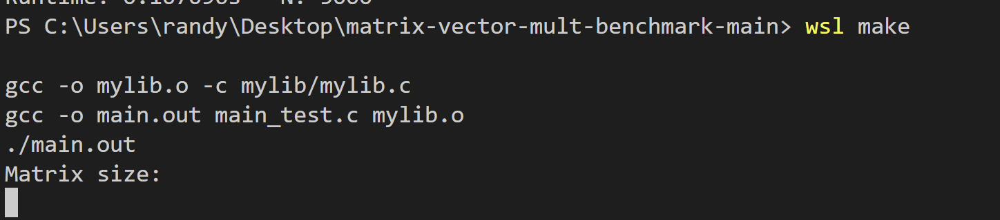
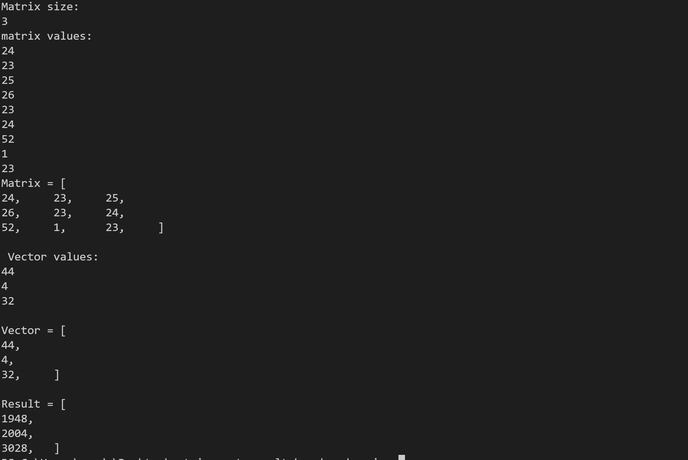
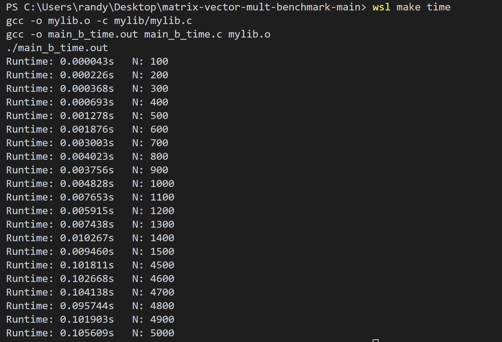
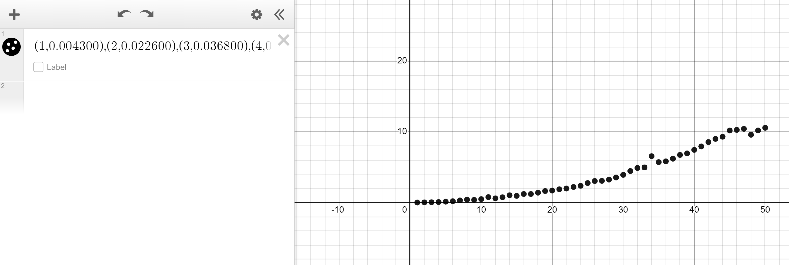
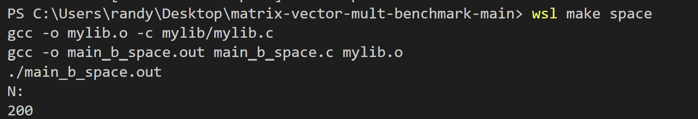
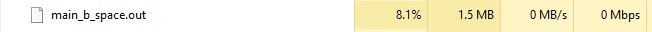
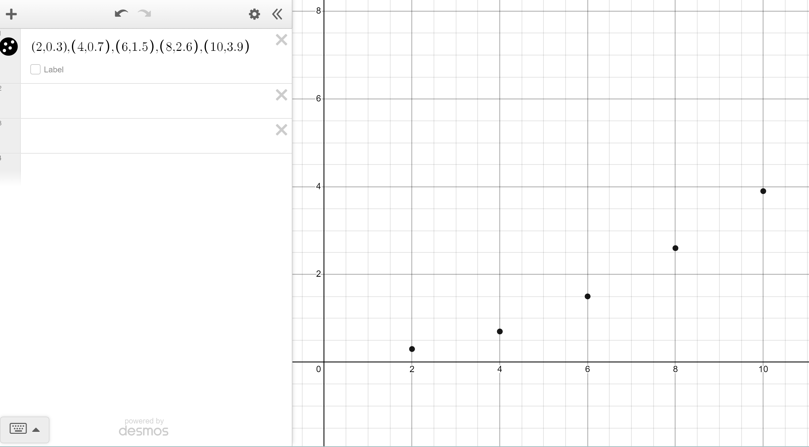

# Matrix Vector Multiplication
### Gde Ngurah Randy Agastya 2602119165
Matrix:  An array of numbers  Vector: A list of numbers

## To run

By writing "wsl make", it will directly run the MAKEFILE commands in which it creates a mylib.o file and main.out in order for the code to return a result

For example: 

This shows matrix vector multiplication by a 3x3 matrix with the vector value of the shown above

## Time complexity
This is the amount of computer time it takes to run the program

To run:

after we get the result in:  
dataRuntime.dat  
dataRuntimeMagnified.dat

we can use the dataruntimemagnified and put it in a graph

 
matrix-vector multiplication time complexity: O(n) (linear progression)

## Space complexity 
 the total space taken by the algorithm in order for it to be able to run and gain a result.
 
 We can test it by writing "wsl make space" which will run an infinite loop so that we can see the memory used from the algorithm (below i use N: 200):

 

 the result: 
 

To compare with other N:

 400:

 

600:

 

800: 
  

1000:
  

This shows that when the N is higher the memory used as seen on the trend above  When N: 200 = Memory: 0.3 MB  When N: 400 = Memory: 0.7 MB 
When N: 600 = Memory: 1.5 MB  
When N: 800 = Memory: 2.6 MB 
When N: 1000 = Memory: 3.9 MB 
  So the trend shows that it keeps on increasing

We can see more clearly from the graph below
  

space complexity of matrix vector multiplication: O(n^2). The value is actually O(n), however, A new matrix is used to store the result of the multiplication.
## conclusion
The time complexity of matrix vector multiplication increases when N increases and it's also the for the space complexity as the memory increases when N is increased

